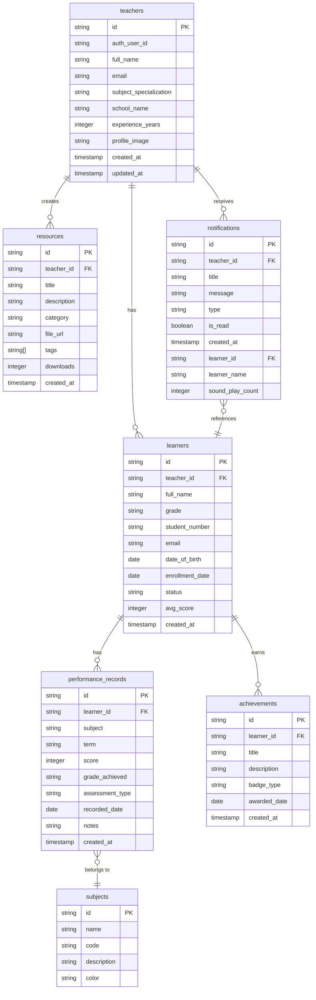

# Teacher Management System - Entity Relationship Diagram (ERD)

## Overview

This document provides a comprehensive Entity Relationship Diagram (ERD) for the Teacher Management System database. The system uses Supabase PostgreSQL with 7 core tables that manage teachers, learners, academic performance, resources, notifications, achievements, and subjects.

## Database Schema Summary

### Tables

1. **teachers** - Teacher profiles and authentication
2. **learners** - Student/learner records
3. **performance_records** - Academic performance tracking
4. **subjects** - Subject/course definitions
5. **resources** - Teaching materials and resources
6. **notifications** - System notifications and alerts
7. **achievements** - Learner achievements and awards

## Mermaid ERD Diagram

## Table Details

### 1. teachers

**Primary Key:** `id` (UUID)
**Description:** Stores teacher profile information linked to Supabase Auth users.

| Column                 | Type          | Nullable | Description                     |
| ---------------------- | ------------- | -------- | ------------------------------- |
| id                     | string (UUID) | NO       | Primary key                     |
| auth_user_id           | string        | NO       | Supabase Auth user ID           |
| full_name              | string        | NO       | Teacher's full name             |
| email                  | string        | NO       | Email address                   |
| subject_specialization | string        | YES      | Teaching subject specialization |
| school_name            | string        | YES      | School name                     |
| experience_years       | integer       | YES      | Years of teaching experience    |
| profile_image          | string        | YES      | Profile image URL               |
| created_at             | timestamp     | NO       | Record creation timestamp       |
| updated_at             | timestamp     | NO       | Last update timestamp           |

### 2. learners

**Primary Key:** `id` (UUID)
**Foreign Key:** `teacher_id` → `teachers.id`
**Description:** Stores learner/student information managed by teachers.

| Column          | Type          | Nullable | Description                       |
| --------------- | ------------- | -------- | --------------------------------- |
| id              | string (UUID) | NO       | Primary key                       |
| teacher_id      | string (UUID) | NO       | Foreign key to teachers           |
| full_name       | string        | NO       | Learner's full name               |
| grade           | string        | NO       | Academic grade (e.g., "Grade 10") |
| student_number  | string        | NO       | Unique student identifier         |
| email           | string        | YES      | Email address                     |
| date_of_birth   | date          | YES      | Date of birth                     |
| enrollment_date | date          | NO       | Enrollment date                   |
| status          | string        | NO       | Status (Active/Inactive)          |
| avg_score       | integer       | NO       | Average performance score         |
| created_at      | timestamp     | NO       | Record creation timestamp         |

### 3. performance_records

**Primary Key:** `id` (UUID)
**Foreign Key:** `learner_id` → `learners.id`
**Description:** Tracks academic performance across subjects and terms.

| Column          | Type          | Nullable | Description                  |
| --------------- | ------------- | -------- | ---------------------------- |
| id              | string (UUID) | NO       | Primary key                  |
| learner_id      | string (UUID) | NO       | Foreign key to learners      |
| subject         | string        | NO       | Subject name                 |
| term            | string        | NO       | Academic term                |
| score           | integer       | NO       | Performance score (0-100)    |
| grade_achieved  | string        | YES      | Letter grade (A, B, C, etc.) |
| assessment_type | string        | NO       | Type of assessment           |
| recorded_date   | date          | NO       | Date recorded                |
| notes           | string        | YES      | Additional notes             |
| created_at      | timestamp     | NO       | Record creation timestamp    |

### 4. subjects

**Primary Key:** `id` (UUID)
**Description:** Defines academic subjects available in the system.

| Column      | Type          | Nullable | Description               |
| ----------- | ------------- | -------- | ------------------------- |
| id          | string (UUID) | NO       | Primary key               |
| name        | string        | NO       | Subject name              |
| code        | string        | NO       | Subject code              |
| description | string        | YES      | Subject description       |
| color       | string        | NO       | Color code for UI display |

### 5. resources

**Primary Key:** `id` (UUID)
**Foreign Key:** `teacher_id` → `teachers.id`
**Description:** Stores teaching resources uploaded by teachers.

| Column      | Type          | Nullable | Description               |
| ----------- | ------------- | -------- | ------------------------- |
| id          | string (UUID) | NO       | Primary key               |
| teacher_id  | string (UUID) | NO       | Foreign key to teachers   |
| title       | string        | NO       | Resource title            |
| description | string        | YES      | Resource description      |
| category    | string        | NO       | Resource category         |
| file_url    | string        | YES      | File storage URL          |
| tags        | string[]      | NO       | Search tags array         |
| downloads   | integer       | NO       | Download count            |
| created_at  | timestamp     | NO       | Record creation timestamp |

### 6. notifications

**Primary Key:** `id` (UUID)
**Foreign Key:** `teacher_id` → `teachers.id`
**Foreign Key:** `learner_id` → `learners.id`
**Description:** System notifications for teachers about learner performance and system events.

| Column           | Type          | Nullable | Description                   |
| ---------------- | ------------- | -------- | ----------------------------- |
| id               | string (UUID) | NO       | Primary key                   |
| teacher_id       | string (UUID) | NO       | Foreign key to teachers       |
| title            | string        | NO       | Notification title            |
| message          | string        | NO       | Notification message          |
| type             | string        | NO       | Type (Achievement/Alert/Info) |
| is_read          | boolean       | NO       | Read status                   |
| created_at       | timestamp     | NO       | Creation timestamp            |
| learner_id       | string (UUID) | YES      | Foreign key to learners       |
| learner_name     | string        | YES      | Learner name for display      |
| sound_play_count | integer       | YES      | Sound notification count      |

### 7. achievements

**Primary Key:** `id` (UUID)
**Foreign Key:** `learner_id` → `learners.id`
**Description:** Tracks learner achievements and awards.

| Column       | Type          | Nullable | Description                                     |
| ------------ | ------------- | -------- | ----------------------------------------------- |
| id           | string (UUID) | NO       | Primary key                                     |
| learner_id   | string (UUID) | NO       | Foreign key to learners                         |
| title        | string        | NO       | Achievement title                               |
| description  | string        | YES      | Achievement description                         |
| badge_type   | string        | NO       | Badge type (Excellence/Improvement/Consistency) |
| awarded_date | date          | NO       | Award date                                      |
| created_at   | timestamp     | NO       | Record creation timestamp                       |

## Relationships

### 1. Teacher-Learner Relationship

- **Type:** One-to-Many
- **Description:** One teacher manages multiple learners
- **Foreign Key:** `learners.teacher_id` → `teachers.id`
- **Cardinality:** 1:N

### 2. Learner-Performance Relationship

- **Type:** One-to-Many
- **Description:** One learner has multiple performance records
- **Foreign Key:** `performance_records.learner_id` → `learners.id`
- **Cardinality:** 1:N

### 3. Teacher-Resources Relationship

- **Type:** One-to-Many
- **Description:** One teacher uploads multiple resources
- **Foreign Key:** `resources.teacher_id` → `teachers.id`
- **Cardinality:** 1:N

### 4. Teacher-Notifications Relationship

- **Type:** One-to-Many
- **Description:** One teacher receives multiple notifications
- **Foreign Key:** `notifications.teacher_id` → `teachers.id`
- **Cardinality:** 1:N

### 5. Learner-Achievements Relationship

- **Type:** One-to-Many
- **Description:** One learner earns multiple achievements
- **Foreign Key:** `achievements.learner_id` → `learners.id`
- **Cardinality:** 1:N

### 6. Performance-Subject Relationship

- **Type:** Many-to-One
- **Description:** Multiple performance records belong to one subject
- **Foreign Key:** `performance_records.subject` → `subjects.name` (logical, not enforced)
- **Cardinality:** N:1

### 7. Notification-Learner Relationship

- **Type:** Many-to-One (optional)
- **Description:** Notifications can reference specific learners
- **Foreign Key:** `notifications.learner_id` → `learners.id`
- **Cardinality:** N:1 (optional)

## Current Implementation Status

### ✅ Tables Currently Using Database

- **teachers** - Fully implemented with AuthContext
- **learners** - Fully implemented with learnerService
- **performance_records** - Recently implemented with performanceService
- **notifications** - Recently implemented with notificationService

### 📋 Tables Using Mock Data (Future Enhancement)

- **achievements** - Using mock data in Achievements.tsx
- **resources** - Using mock data in Resources.tsx
- **subjects** - Not directly used in current implementation

## Business Logic Notes

1. **Notification System:** Automatically generates notifications when learners are at risk or excel
2. **Performance Tracking:** Calculates success probability based on historical performance
3. **Student Number Generation:** Unique student numbers generated per teacher
4. **Authentication:** Teacher profiles linked to Supabase Auth users
5. **Data Persistence:** Dual-write pattern (localStorage + database) for notifications

## Future Enhancement Opportunities

1. **Achievements Database Integration:** Connect Achievements page to database
2. **Resources Database Integration:** Connect Resources page to database
3. **Subjects Reference Table:** Implement proper subject management
4. **Reporting Module:** Advanced analytics and reporting
5. **Parent Portal:** External access for parents/guardians

---

_Last Updated: 2026-02-24_
_System: Teacher Management System_
_Database: Supabase PostgreSQL_
