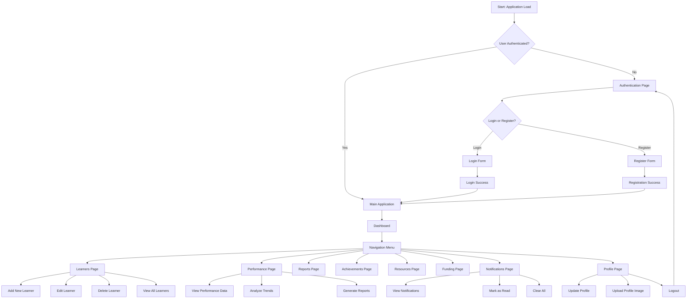
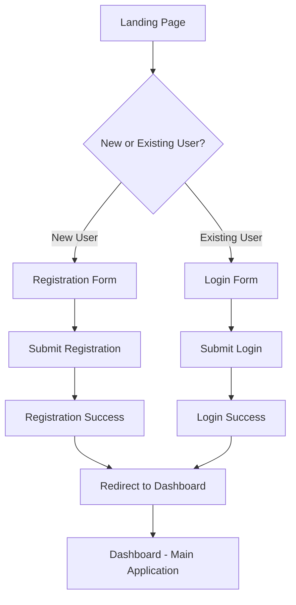
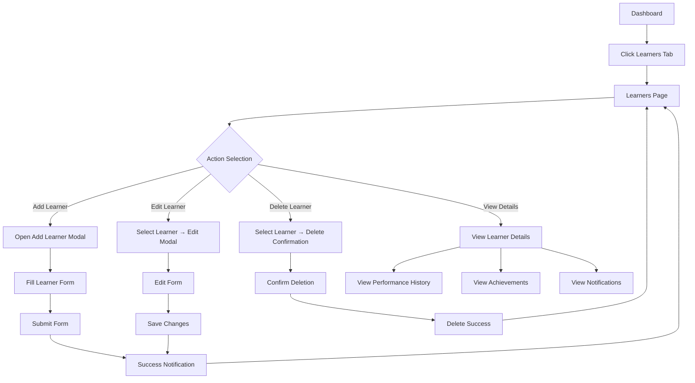
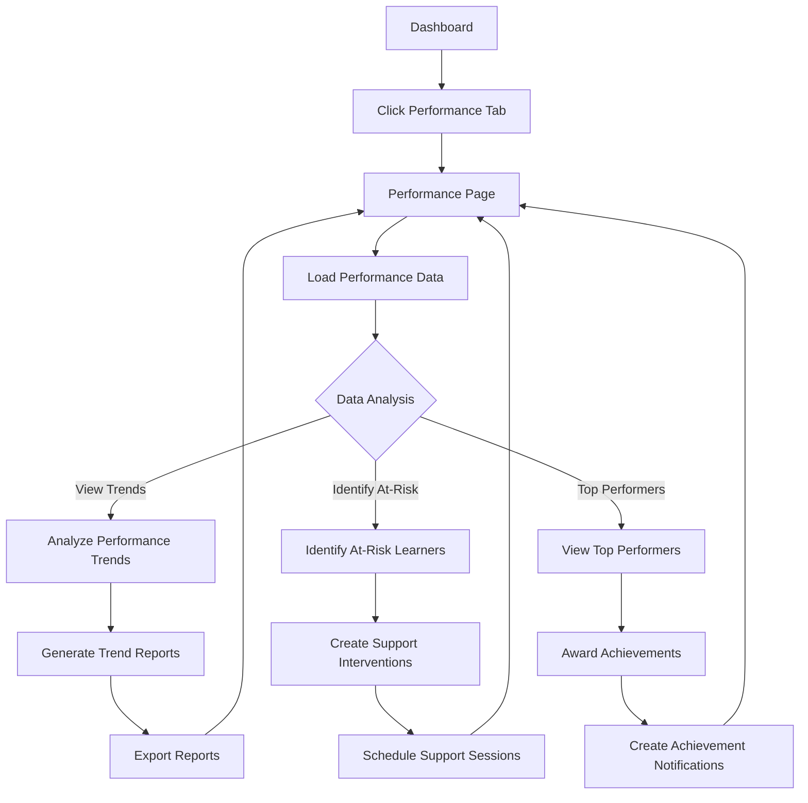
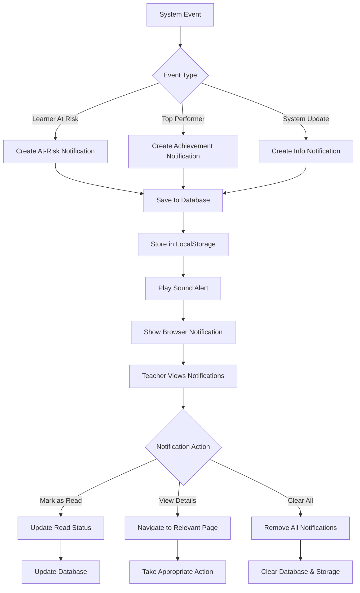
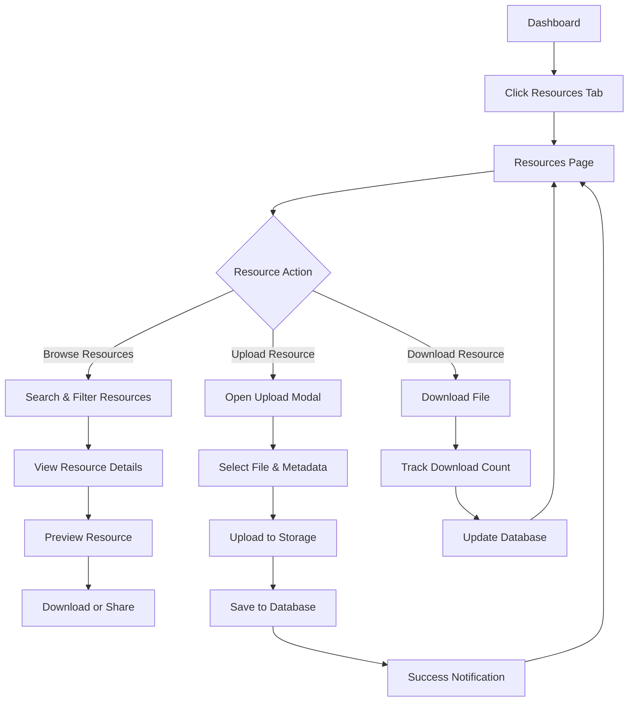

# Teacher Management System - User Flow Diagram

## Overview

This document outlines the user flows and navigation pathways for the Teacher Management System. The application is designed for teachers to manage learners, track academic performance, access resources, and receive system notifications.

## Primary User Role

**Teacher** - The main user who manages learners, tracks performance, and uses teaching resources.

## Application Navigation Structure

## Detailed User Flows

### 1. Authentication Flow

**Path:** Unauthenticated User → Authentication Choice → Main Application

### 2. Learner Management Flow

**Path:** Dashboard → Learners Page → Manage Learners

### 3. Performance Tracking Flow

**Path:** Dashboard → Performance Page → Analyze Data

### 4. Notification System Flow

**Path:** System Events → Notification Generation → Teacher Action

### 5. Resource Management Flow

**Path:** Dashboard → Resources Page → Manage Teaching Materials

## Key Decision Points

### 1. Authentication Decision

- **New User:** Redirect to Registration → Create Teacher Profile
- **Existing User:** Redirect to Login → Validate Credentials → Load Dashboard

### 2. Learner Action Decision

- **Add:** Open modal → Fill form → Validate → Save to database
- **Edit:** Select learner → Open edit modal → Update → Save changes
- **Delete:** Select learner → Confirm → Remove from database
- **View:** Select learner → Show details → Navigate to related data

### 3. Performance Analysis Decision

- **Trend Analysis:** View historical performance → Identify patterns
- **Intervention Needed:** Identify at-risk learners → Create support plans
- **Recognition:** Identify top performers → Award achievements

### 4. Notification Action Decision

- **Acknowledge:** Mark as read → Update status
- **Act:** Navigate to relevant page → Take action
- **Dismiss:** Clear notification → Remove from view

## Page Transitions and Navigation

### Primary Navigation Paths:

1. **Dashboard → Learners → Performance → Reports** (Core workflow)
2. **Dashboard → Notifications → Relevant Page** (Alert-driven navigation)
3. **Dashboard → Resources → Upload/Download** (Resource management)
4. **Dashboard → Profile → Settings** (Account management)

### Secondary Navigation Paths:

1. **Performance → Achievements** (Performance recognition)
2. **Learners → Notifications** (Learner-specific alerts)
3. **Reports → Resources** (Report-based resource finding)

## User Experience Considerations

### 1. Seamless Authentication

- Persistent login sessions
- Automatic redirect to last visited page
- Clear error messages for failed authentication

### 2. Efficient Data Management

- Real-time data updates
- Bulk operations for learner management
- Import/export capabilities

### 3. Proactive Notifications

- Sound alerts for important notifications
- Browser notifications for system events
- Email notifications for critical alerts

### 4. Responsive Design

- Mobile-friendly navigation
- Collapsible sidebar for smaller screens
- Touch-friendly interface elements

## System Integration Points

### 1. Database Integration

- Supabase PostgreSQL for data persistence
- Real-time subscriptions for live updates
- Row Level Security for data protection

### 2. File Storage

- Supabase Storage for resource files
- Image upload for profile pictures
- Document management for teaching materials

### 3. Notification Services

- Browser Notification API
- Email service integration
- Sound playback for alerts

### 4. Authentication

- Supabase Auth for user management
- Session persistence
- Profile synchronization

## Future Flow Enhancements

### 1. Parent Portal Integration

- Parent registration and login
- Learner progress sharing
- Parent-teacher communication

### 2. Advanced Reporting

- Custom report generation
- Data visualization dashboards
- Export to multiple formats

### 3. Mobile Application

- Native mobile app flows
- Offline data access
- Push notifications

### 4. Collaboration Features

- Teacher collaboration workflows
- Resource sharing between teachers
- Team teaching coordination

---

_Last Updated: 2026-02-24_
_System: Teacher Management System_
_User Role: Teacher_
